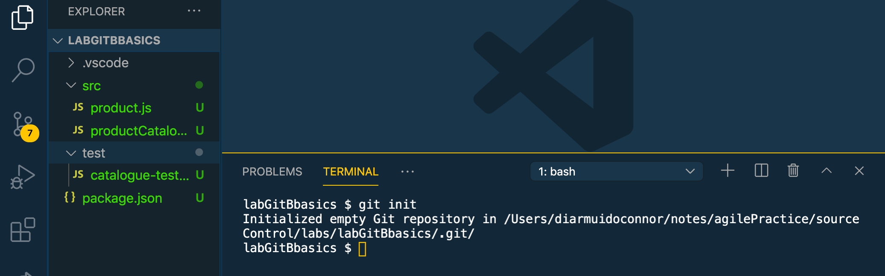
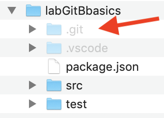
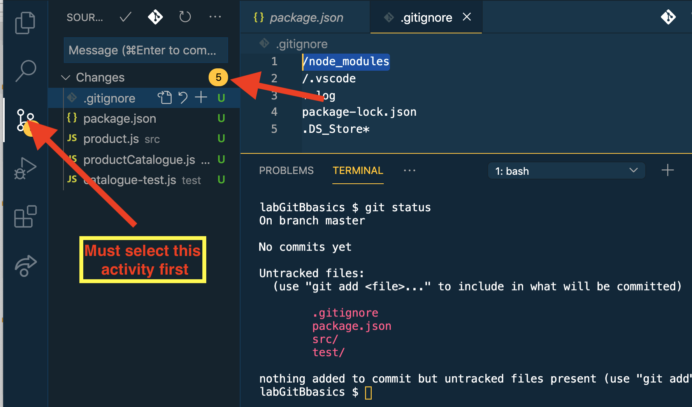
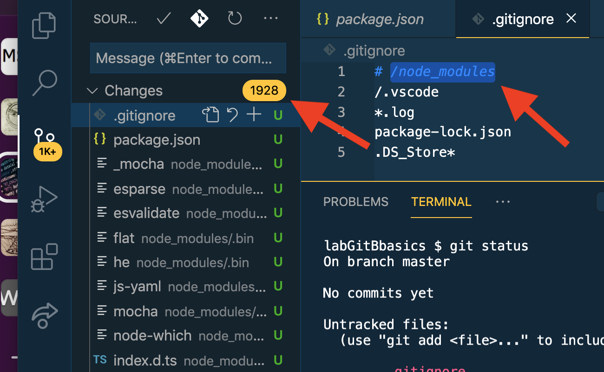

# Startup

Unzip [this archive](https://github.com/diarmuidoconnor/dit-basics/tree/72d218e2cd4cf3dd8496c43c86ab12c56695734e/sections/start.zip) - it contains the initial file structure for the Catalogue project. Import the project into VS Code, open an integrated terminal in the editor and create a local Git repository \(repo\), with the command:

```text
$ git init
```



The command created a new sub-folder called `.git` - this is the local repository.



Let's make sure everything works before continuing:

```text
$ npm install
$ npm run test
```

Returning to Git, its important that we do not commit/add certain types of files to a repository, including:

* 3rd party libraries
* Generated files, e.g. .log, .class \(Java\)
* Operating System filesystem management files
* IDE/Editor configuration files.

To safeguard against their inclusion **at the start of a project we must** create a special file in the project base folder \(`labGitBasics`\), called `.gitignore` \(the . prefix is important\). For this simple project initialize it to:

```text
/node_modules
/.vscode
*.log
package-lock.json
.DS_Store*
```

Now type the command:

```text
$ git status
```

The response shows the 'status' of the project's working directory: the files/folders that will be added to the repo the next time we perform a commit. VS Code has excellent support for git, The screenshot lists all the files \(5\) 5 that will be added to the repo:



As a simple illustration of gitignore's role, comment out the file's first line and notice how many file could now be \(incorrectly\) added to the repo:



**UNDO THE CHANGE TO .gitignore**

Now perform the first commit, with these commands:

```text
$ git add -A 
$ git commit -m "Initial project structure"
```

This stores the initial version of the project to the local repository - sometimes referred to as version 0. Notice, the status of the project's working directory now indicates their are no files to be added to the repository - the repository and working directory are **in sync**.

As we progress through this lab we will make changes to the working directory by editing and adding new files. These changes need to be **committed** \(saved\) to the repo to retain the 'in sync' status.

