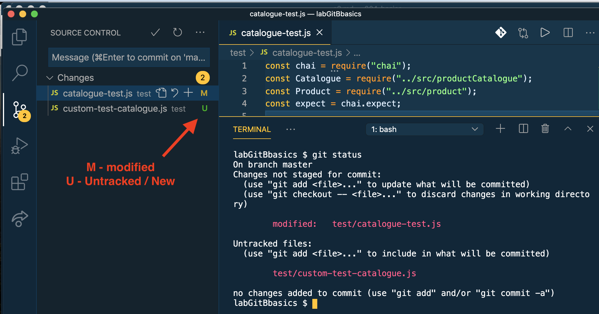
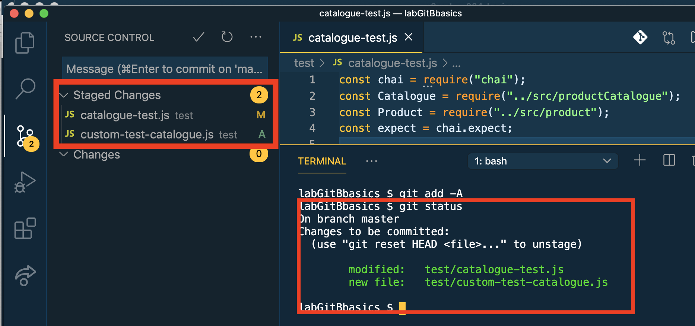
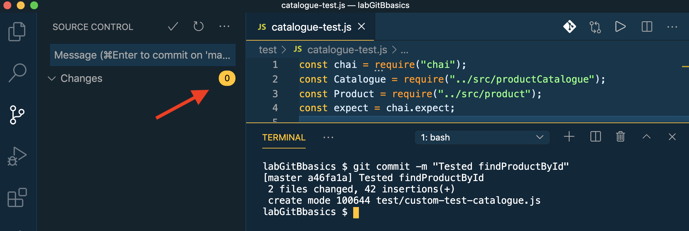

# Staging & Committing

In the `test` folder create the file `custom-test-catalogue.js.js` and paste in the following:

```text
const Catalogue = require("../src/productCatalogue");
const Product = require("../src/product");
// Setup
const cat = new Catalogue("Test Catalogue");
cat.addProduct(new Product("A123", "Product 1", 100, 10, 10.0));
cat.addProduct(new Product("A124", "Product 2", 100, 10.0));
cat.addProduct(new Product("A125", "Product 3", 100, 10, 10.0));

// Test findProductById
let id = "A123";
let match = cat.findProductById(id);
if (match.id !== id) {
  console.log("find by id for valid id - Failed for valid name");
}
id = "A321";
match = cat.findProductById(id);
if (match) {
  console.log("find by id for invalid id - Failed");
}
```

In the file `test/catalogue-test.js` replace its content with the following:

```text
const chai = require("chai");
const Catalogue = require("../src/productCatalogue");
const Product = require("../src/product");
const expect = chai.expect;

let cat = null;
let batch = null;

// Setup
cat = new Catalogue("Test Catalogue");
cat.addProduct(new Product("A123", "Product 1", 100, 10, 10.0));
cat.addProduct(new Product("A124", "Product 2", 100, 10.0));
cat.addProduct(new Product("A125", "Product 3", 100, 10, 10.0));

describe("Catalogue", () => {
  describe("findProductById", function () {
    it("should find a valid product id", function () {
      const result = cat.findProductById("A123");
      expect(result.name).to.equal("Product 1");
    });
    it("should return undefined for invalid product id", function () {
      const result = cat.findProductById("A321");
      expect(result).to.be.undefined;
    });
  });
});
```

To ensure the correctness of this code, run the tests:

```text
$ npm run test
```

Assuming the tests pass, type the command:

```text
$ git status
```

This command reports the **status of the working directory** in relation to the repository. VS Code's Git integration gives the same information:



An **untracked** file means the repository has no record of it - it's new.

Type the commands:

```text
$ git add -A           (-A - all modified/new files)
$ git status
```

The status now indicates the new and modified files are now **staged**, or as Git phrases it: "Changes to be committed".



Type the command:

```text
$ git commit -m "Tested findProductById"
```

Note we do not specify any file names in the command. Git commits what has been staged beforehand. The command's response is not very user-friendly but it does indicate that 2 file changes were applied to the repository. Check the status again:

```text
$ git status
```

The working directory and repository are in sync again, as reflected by the message:

> > nothing to commit, working directory clean



