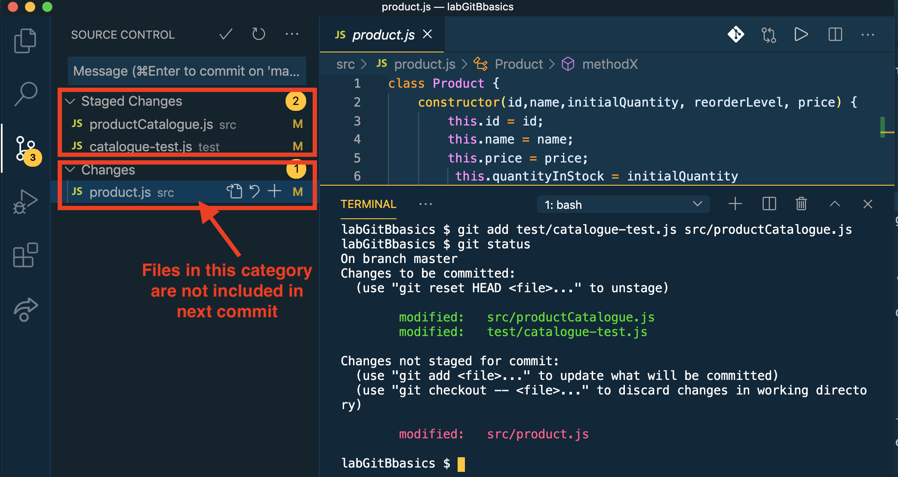
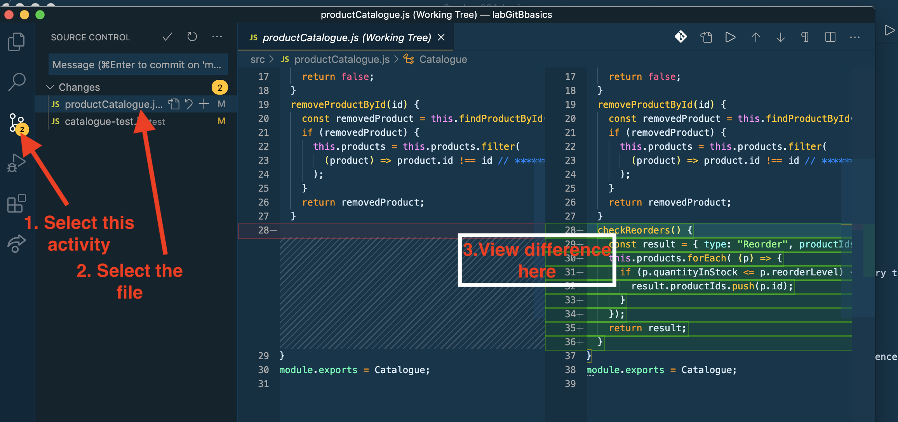
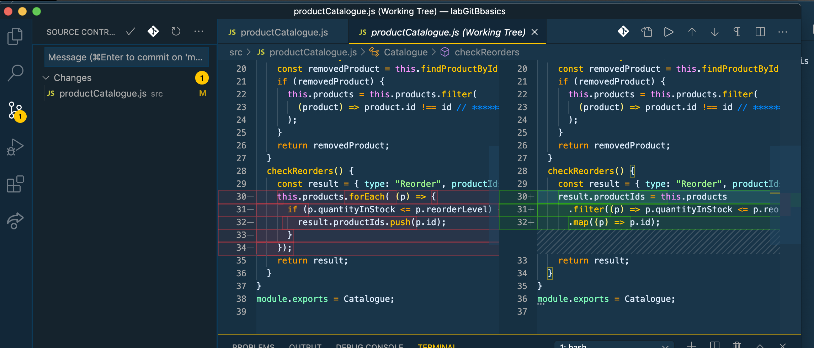

# Selective Staging & Diffing

In `src/productCatalogue.js` add a new method:

```text
  removeProductById(id) {
    const removedProduct = this.findProductById(id);
    if (removedProduct) {
      this.products = this.products.filter(
        (product) => product.id !== id // ***********
      );
    }
    return removedProduct;
  }
```

In `test/catalogue-test.js` add the related tests \(you know how to add this from the earlier lab\):

```text
  describe("removeProductById", () => {
    it("should remove product with a valid id", function () {
      let result = cat.removeProductById("A123");
      expect(result.id).to.equal("A123");
      // Check object state
      result = cat.findProductById("A123");
      expect(result).to.be.undefined;
    });
    it("should return undefined when asked to remove invalid product", function () {
      const result = cat.removeProductById("A321");
      expect(result).to.be.undefined;
    });
  });
```

Run the tests \(to prove everything works\):

```text
$ npm run test
```

For the purpose of illustrating a feature of Git, we will make a fictitious change to the source code. Add a new \(dummy\) method to `src/profuct.js` - assume it is related to a feature of the project, but not related to the other file changes above:

```text
    methodX() {
        // do something
    }
```

The status of the project working directory shows their are three modified files. Git best practice recommends:

1. Commit coherent units of work.
2. Avoid committing untested source code.

Applying these principles, we should not include the change to `product.js` in the next commit. Type the following commands:

```text
$ git add test/catalogue-test.js src/productCatalogue.js 
$ git status
```



Now perform a commit:

```text
$ git commit -m "Implemented and tested removeProductById"
$ git status
```

What are the lessons her: 1. We committed the group of changes that represent a coherent unit of work. 1. Files that are modified but not connected the work unit can be omitted from the commit. 1. Their can be modified file immediately after a commit - product.js in our case.

We should undo the change to `product.js`. You can do it manually or from the command line:

```text
$ git reset --hard src/product.js
```

For obvious reasons, you should **minimize usage of this command** and favor the \(slower\) manual approach - the command can result it losing unforeseen changes.

Add the checkReorders method to `productCatalogue.js`:

```text
  checkReorders() {
    const result = { type: "Reorder", productIds: [] };
    this.products.forEach( (p) => {
      if (p.quantityInStock <= p.reorderLevel) {
        result.productIds.push(p.id);
      }
    });
    return result;
  }
```

Add the test cases to `catalogue-test.js`:

```text
  describe("checkReorder", () => {
    it("should return an empty array when no products need reordering", function () {
      const result = cat.checkReorders();
      expect(result.productIds).to.be.empty;
    });
    it("should report products that satisfy reorder criteria", function () {
      cat.addProduct(new Product("B123", "Product 4", 10, 20, 10.0));
      cat.addProduct(new Product("B124", "Product 5", 10, 30, 10.0));
      const result = cat.checkReorders();
      expect(result.productIds).to.have.lengthOf(2);
      expect(result.productIds).to.have.members(["B123", "B124"]);
    });
    it("should include products just on their reorder level", function () {
      cat.addProduct(new Product("B125", "Product 6", 10, 10, 10.0));
      const result = cat.checkReorders();
      expect(result.productIds).to.have.members(["B125"]);
    });
    it("should handle an empty catalogue", function () {
      cat = new Catalogue("Test catalogue");
      const result = cat.checkReorders();
      expect(result.productIds).to.be.empty;
    });
  });
```

Run the tests.

Sometimes we want to know what changes have happened in a file since the last commit. Using VS Code's Git support is the easiest way:



Commit the above changes:

```text
$ git add -A
$ git commit -m "CheckReorders implemented and tested"
```

Refactor `productCatalogue.js`:

```text
 checkReorders() {
    const result = { type: "Reorder", productIds: [] };
    result.productIds = this.products
      .filter((p) => p.quantityInStock <= p.reorderLevel)
      .map((p) => p.id);
    return result;
  }
```

Run the tests.

Check the difference in the file:



Commit the above changes:

```text
$ git add -A
$ git commit -m "Refactor: CheckReorders"
```

